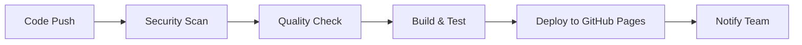

# 🔒 Security Alert Prioritization Dashboard

[](https://github.com/vekis11/security-alert-prioritization/actions/workflows/ci-cd.yml)
[](https://github.com/vekis11/security-alert-prioritization/actions/workflows/security-scan.yml)
[](https://snyk.io/test/github/vekis11/security-alert-prioritization)
[](https://vekis11.github.io/security-alert-prioritization)

> **AI-powered security alert and vulnerability prioritization dashboard with comprehensive CI/CD pipeline and automated security scanning**

## 🚀 **Live Demo**

**🌐 [View Live Dashboard](https://vekis11.github.io/security-alert-prioritization)**

## 📋 **Table of Contents**

- [Features](#-features)
- [Architecture](#-architecture)
- [Security Integrations](#-security-integrations)
- [CI/CD Pipeline](#-cicd-pipeline)
- [Quick Start](#-quick-start)
- [Development](#-development)
- [Testing](#-testing)
- [Security Scanning](#-security-scanning)
- [Deployment](#-deployment)
- [Contributing](#-contributing)

## ✨ **Features**

### 🤖 **AI-Powered Analysis**
- **OpenAI GPT-4 Integration** for intelligent threat analysis
- **Automated Prioritization** with detailed explanations
- **Risk Scoring** and business impact assessment
- **Remediation Planning** with step-by-step guidance
- **Threat Intelligence** and contextual analysis

### 🔗 **20+ Security Tool Integrations**
- **Vulnerability Management**: Tenable, Qualys, Rapid7, Vulcan Cyber, Kenna Security
- **EDR/XDR Platforms**: CrowdStrike, SentinelOne, Palo Alto, Microsoft Defender, Carbon Black
- **SIEM/SOAR**: Splunk, IBM QRadar, Splunk Phantom, FireEye Helix
- **Application Security**: Veracode, Checkmarx
- **AI/ML Security**: Darktrace Enterprise Immune System
- **Ticketing/Workflow**: Jira Security, ServiceNow Security Operations

### 📊 **Real-time Dashboard**
- **Live WebSocket Updates** for real-time monitoring
- **Interactive Charts** and data visualizations
- **Responsive Design** for mobile and desktop
- **Role-based Access Control** with JWT authentication
- **Customizable Alerts** and notifications

### 💬 **Slack Integration**
- **Real-time Notifications** for critical alerts
- **Interactive Buttons** for alert management
- **Daily/Weekly Reports** with security summaries
- **Slash Commands** for quick status checks
- **Team Collaboration** features

## 🏗️ **Architecture**

```
┌─────────────────┐    ┌─────────────────┐    ┌─────────────────┐
│   React Frontend │    │  Node.js Backend│    │   MongoDB       │
│   (Port 3000)   │◄──►│   (Port 5000)   │◄──►│   Database      │
└─────────────────┘    └─────────────────┘    └─────────────────┘
         │                       │                       │
         │                       │                       │
         ▼                       ▼                       ▼
┌─────────────────┐    ┌─────────────────┐    ┌─────────────────┐
│   GitHub Pages  │    │   OpenAI API    │    │  Security Tools │
│   (Deployment)  │    │   (AI Analysis) │    │  (20+ Tools)    │
└─────────────────┘    └─────────────────┘    └─────────────────┘
```

## 🔒 **Security Integrations**

| Category | Tools | Status |
|----------|-------|--------|
| **Vulnerability Management** | Tenable, Qualys, Rapid7, Vulcan Cyber, Kenna Security | ✅ Ready |
| **EDR/XDR** | CrowdStrike, SentinelOne, Palo Alto, Microsoft Defender, Carbon Black | ✅ Ready |
| **SIEM/SOAR** | Splunk, IBM QRadar, Splunk Phantom, FireEye Helix | ✅ Ready |
| **Application Security** | Veracode, Checkmarx | ✅ Ready |
| **AI/ML Security** | Darktrace Enterprise Immune System | ✅ Ready |
| **Ticketing** | Jira Security, ServiceNow Security Operations | ✅ Ready |

## 🔄 **CI/CD Pipeline**

### **Automated Workflows**

1. **🛡️ Security Scanning**
   - **Snyk Vulnerability Scanning** (daily)
   - **OWASP Dependency Check** (on every push)
   - **CodeQL Security Analysis** (on every PR)
   - **Automated Security Reports** with recommendations

2. **🧪 Quality Assurance**
   - **ESLint Code Quality** checks
   - **Prettier Code Formatting** validation
   - **Jest Unit Testing** with coverage reports
   - **Automated Testing** on multiple Node.js versions

3. **🚀 Deployment**
   - **Automated Build** and testing
   - **GitHub Pages Deployment** for production
   - **Artifact Management** with retention policies
   - **Deployment Notifications** and status updates

### **Pipeline Stages**



## 🚀 **Quick Start**

### **Prerequisites**
- Node.js 18+
- MongoDB (local or Atlas)
- OpenAI API Key
- Git

### **1. Clone Repository**
```bash
git clone https://github.com/vekis11/security-alert-prioritization.git
cd security-alert-prioritization
```

### **2. Install Dependencies**
```bash
npm run install-all
```

### **3. Configure Environment**
```bash
cp env.example .env
# Edit .env with your API keys
```

### **4. Start Development**
```bash
npm run dev
```

### **5. Access Dashboard**
- **Frontend**: http://localhost:3000
- **Backend**: http://localhost:5000

## 🛠️ **Development**

### **Available Scripts**

```bash
# Development
npm run dev              # Start both frontend and backend
npm run server           # Start backend only
npm run client           # Start frontend only

# Testing
npm test                 # Run all tests
npm run test:coverage    # Run tests with coverage
npm run test:watch       # Run tests in watch mode

# Code Quality
npm run lint             # Run ESLint
npm run lint:fix         # Fix ESLint issues
npm run format           # Format code with Prettier
npm run format:check     # Check code formatting

# Security
npm run security:audit   # Run npm audit
npm run security:fix     # Fix security vulnerabilities
npm run security:snyk   # Run Snyk security scan

# Dependencies
npm run deps:check       # Check for outdated packages
npm run deps:update   # Update packages
```

### **Project Structure**
```
security-alert-prioritization/
├── client/                 # React frontend
│   ├── src/
│   │   ├── components/     # Reusable components
│   │   ├── pages/         # Page components
│   │   ├── contexts/      # React contexts
│   │   └── __tests__/     # Frontend tests
├── server/                 # Node.js backend
│   ├── routes/            # API routes
│   ├── services/          # Business logic
│   ├── models/            # Database models
│   └── __tests__/         # Backend tests
├── .github/workflows/      # CI/CD workflows
├── docs/                   # Documentation
└── tests/                  # Integration tests
```

## 🧪 **Testing**

### **Test Coverage**
- **Unit Tests**: Jest for backend and frontend
- **Integration Tests**: API endpoint testing
- **Security Tests**: Vulnerability scanning
- **Performance Tests**: Load testing

### **Running Tests**
```bash
# Run all tests
npm test

# Run with coverage
npm run test:coverage

# Run specific test suites
npm run test:backend
npm run test:frontend
```

## 🔒 **Security Scanning**

### **Automated Security Checks**
- **Snyk**: Daily vulnerability scanning
- **OWASP**: Dependency vulnerability analysis
- **CodeQL**: Static code analysis
- **npm audit**: Package vulnerability checks

### **Security Reports**
- **Daily Security Reports** via GitHub Actions
- **Vulnerability Notifications** via Slack
- **Security Metrics** and trend analysis
- **Compliance Reporting** for audit requirements

## 🚀 **Deployment**

### **GitHub Pages Deployment**
The application is automatically deployed to GitHub Pages on every push to the main branch.

**Live URL**: https://vekis11.github.io/security-alert-prioritization

### **Deployment Process**
1. **Code Push** to main branch
2. **Automated Testing** and security scanning
3. **Build Process** for production
4. **GitHub Pages Deployment**
5. **Health Check** and monitoring

### **Environment Configuration**
```env
# Production Environment Variables
NODE_ENV=production
MONGODB_URI=your-production-mongodb-uri
OPENAI_API_KEY=your-openai-api-key
JWT_SECRET=your-production-jwt-secret
```

## 📊 **Monitoring & Analytics**

### **Health Monitoring**
- **API Health Checks** every 5 minutes
- **Database Connection** monitoring
- **Service Status** tracking
- **Performance Metrics** collection

### **Security Metrics**
- **Vulnerability Trends** over time
- **Security Tool Integration** status
- **Alert Processing** statistics
- **AI Analysis** performance metrics

## 🤝 **Contributing**

### **Development Workflow**
1. **Fork** the repository
2. **Create** a feature branch
3. **Make** your changes
4. **Run** tests and security scans
5. **Submit** a pull request

### **Code Standards**
- **ESLint** for code quality
- **Prettier** for code formatting
- **Jest** for testing
- **Conventional Commits** for commit messages

### **Security Guidelines**
- **Never commit** API keys or secrets
- **Use** environment variables for configuration
- **Follow** security best practices
- **Report** security vulnerabilities responsibly

## 📄 **License**

This project is licensed under the MIT License - see the [LICENSE](LICENSE) file for details.

## 🆘 **Support**

- **Documentation**: [Wiki](https://github.com/vekis11/security-alert-prioritization/wiki)
- **Issues**: [GitHub Issues](https://github.com/vekis11/security-alert-prioritization/issues)
- **Discussions**: [GitHub Discussions](https://github.com/vekis11/security-alert-prioritization/discussions)
- **Security**: [Security Policy](https://github.com/vekis11/security-alert-prioritization/security/policy)

## 🏆 **Acknowledgments**

- **OpenAI** for AI-powered threat analysis
- **Snyk** for vulnerability scanning
- **GitHub** for CI/CD and hosting
- **Security Community** for best practices and feedback

---

**🔒 Built with security in mind. Deployed with confidence.**